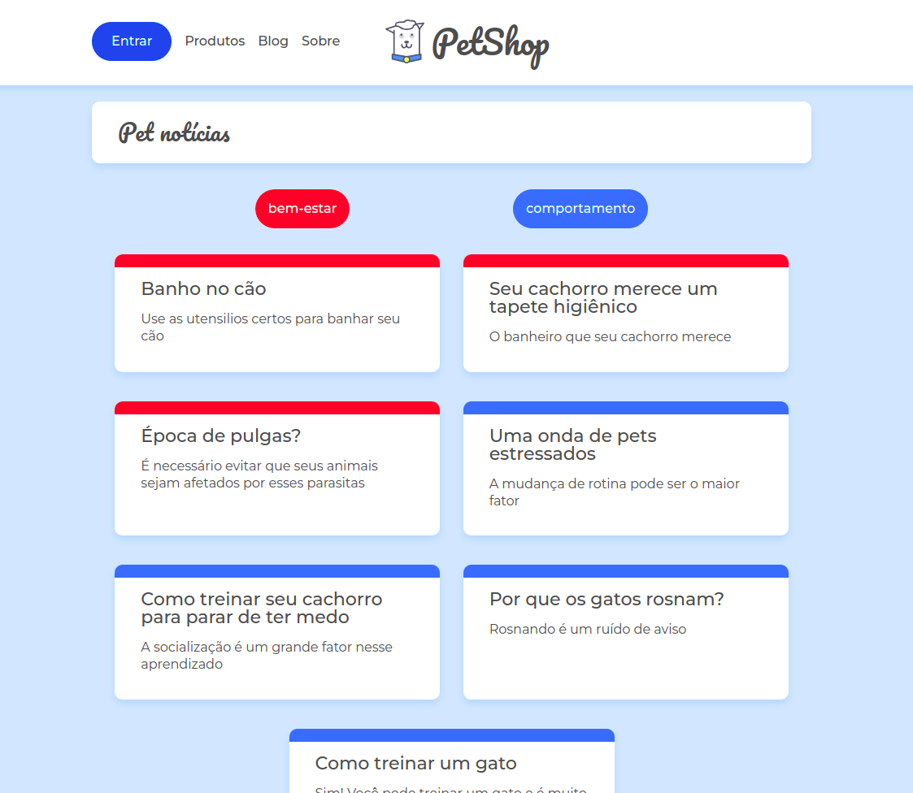
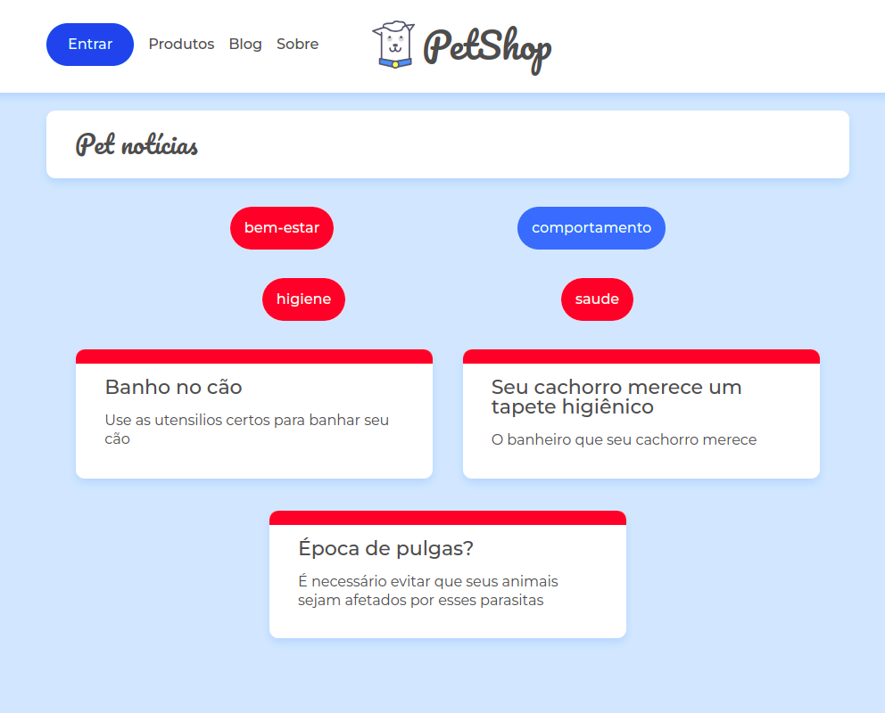
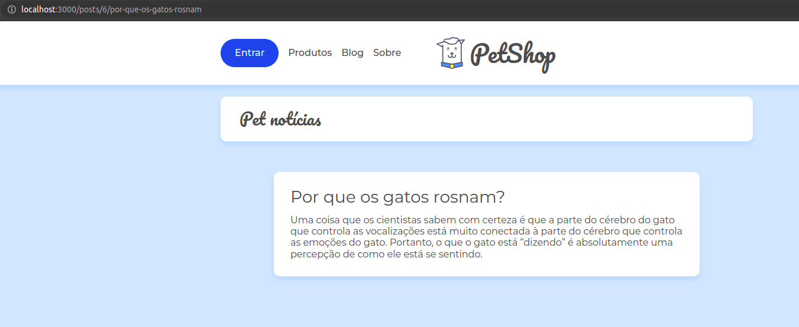
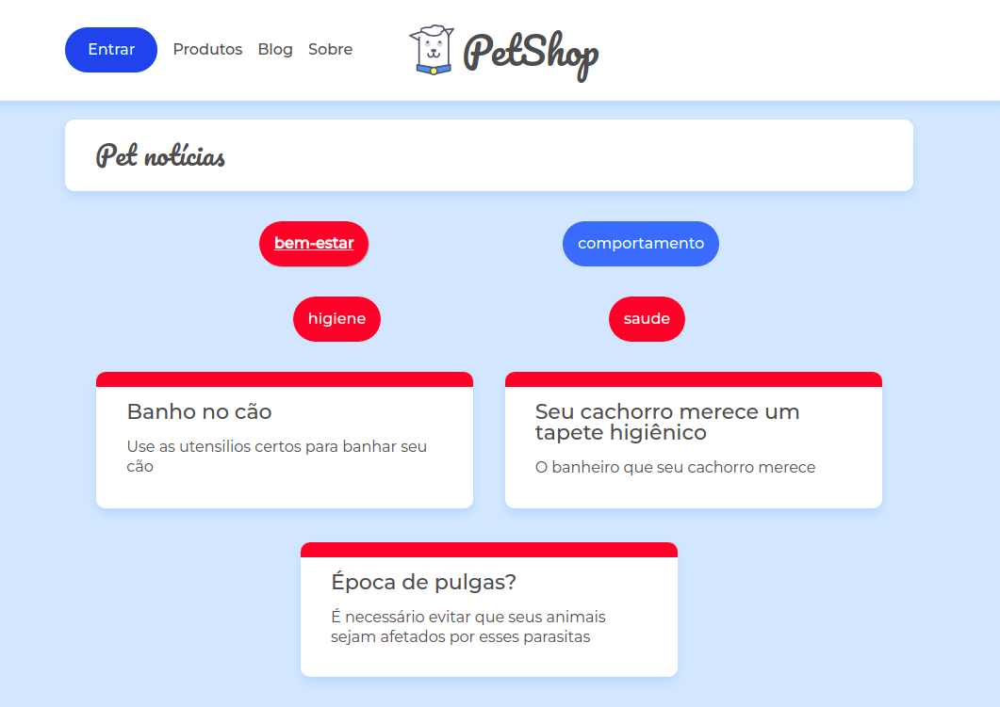
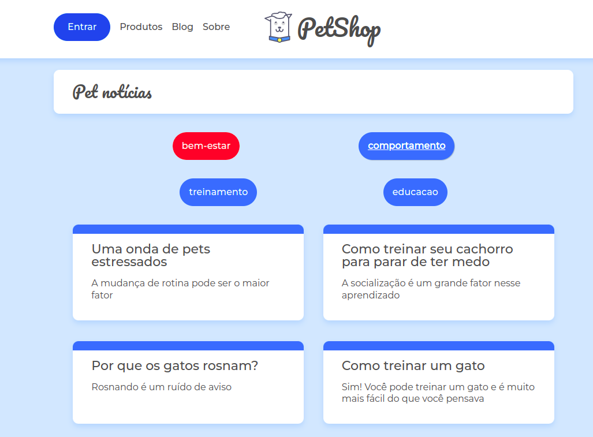
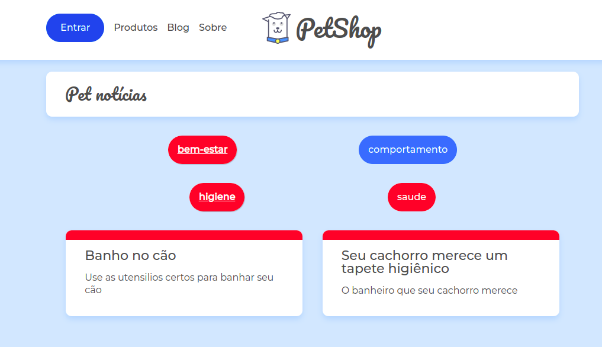

# Blog Utilizando React Router

Este projeto foi desenvolvido durante o curso Alura *"React Router: Navegação em uma SPA"*, ministrado pelo instrutor *Felipe Nascimento*, como parte da trilha de treinamentos do programa de estágios Sensedia.

Trata-se de um blog que consumirá uma api mockada em um arquivo json, servida pelo package ***json-server***, tendo como objetivo demonstrar a criação e utilização de rotas em uma aplicação SPA React.

## Imagens do SPA

Home


Filtragem por Categoria


## Alterações do Projeto Original

Foram realizadas algumas alterações que geraram diferenças entre o projeto original do curso e este. A maioria das mudanças foram focadas em melhorias de UX e/ou melhor componetização para redução de redundancias de código.

### URL Amigável

A primeira mudança a elencar é a utilização de uma "url amigável". No código original, ao se navegar a um determinado post, a url apresentada no navegador seria no formato *.../posts/id_do_post*. A mudança foi realizada utilizando os paramentros disponibilizados pela biblioteca *React Router* para construir uma url no formato *.../posts/id/nome_do_post*. Assim foi necessário isolar uma função que normalizasse o título do post retirando os acentos, as caixas altas e substituisse os espaços pelo caracter '-'. Segue o código alterado.

```javascript
//normalização
export const normalizeUrl = (url) => url.normalize('NFD').replace(/[\u0300-\u036f]/g, "").replace(/ /g, '-').toLowerCase();

// Link dentro da função map para gerar dinamicamente os cards dos posts
<Link to={`/posts/${post.id}/${normalizeUrl(post.title)}`} key={post.id} className={`cartao-post cartao-post--${post.categoria}`}>
    <article>
        <h3 className="cartao-post__titulo">{post.title}</h3>
        <p className="cartao-post__meta">{post.metadescription}</p>
    </article>
</Link>
```



### Diminuição de Repetição de Código

O projeto original utilizava um mesmo trecho de código nas páginas *Categoria.jsx* e *Home.jsx*. este código foi componentizado e incluido no arquivo *App.jsx* para que apareça em todas as páginas, servindo como um banner.

```javascript
import React from "react";

const Banner = () => 
<div className="container">
    <h2 className="titulo-pagina">Pet notícias</h2>
</div>;

export default Banner;
```

### Melhoria no UX

Uma melhoria implementada que não tem relação direta com o projeto, mas melhora a interação, foi a inclusão condicional de uma classe CSS para marcar as categorias e subcategorias selecionadas para filtro.

```javascript
<li className={`${window.location.href.includes(subcategoria) ? 'active-link' : ''} lista-categorias__categoria lista-categorias__categoria--${id}`}>
    {subcategoria}
</li>
```

```css
.active-link {
    font-weight: bolder;
    box-shadow: 1px 1px 1px rgba(0, 0, 0, 0.2);
    text-decoration: underline;
}
```

Categoria Selecionada




Subcategoria Selecionada


## Instalação

Faça o clone do projeto em sua maquina utilizando o comando 
```bash
git clone https://github.com/ERAjeje/AluraReactRouterSensedia.git
```

Dentro da pasta do projeto rode o comando para instalação das dependencias

```bash
npm install
```

ou

```bash
yarn
```

## Rodando o projeto

Dentro da pasta do projeto utilize o comando

```bash
json-server -w db.json -p 5000
```

para iniciar o servidor da API.

Após isso utilize o código

```bash
npm start
```

ou

```bash
yarn start
```

para abrir o projeto 